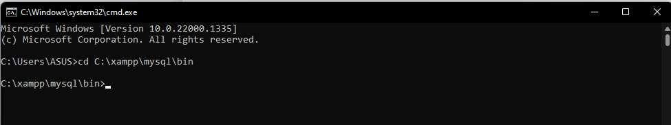
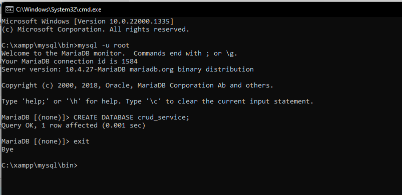

# CRUD User Management Service
Rest API for user management as well as login, change password, and user info

## Run Locally

Clone the project

```bash
  git clone https://github.com/irfangerard44/Agit-Technical-Test.git
```

Go to the project directory

```bash
  cd Agit-Technical-Test
```

### MySQL preperation
you have to import this crud_service.sql to get stored procedure used to generate id
  - Open Command Prompt and navigate to directory C:\xampp\mysql\bin

  

  - Login to mysql and create database then exit

  

  - following syntax for import database
    ```bash
      mysql -u username -p database_name < file.sql
    ```
    username = you’r username mysql database
    database_name = Database name in which you want to import.
    file.sql = sql file in this folder
    
  - Change application change the application properties according to your environment on Agit/src/main/resources/application.properties
      

### Preparation crud service (Agit folder name is spring boot project) on IDE
Go to the Spring boot project  directory
  - Import Spring boot project to you’r IDE
  - Then run the project  

### Preparation crud service (Agit folder name is spring boot project) on Docker
- build docker image
  ```bash
    docker build -t agit-crud-service .
  ```
- running docker image
  ```bash
    docker run -d -p 8080:8080 agit-crud-service:latest
  ```

### Try endpoint
- Open http://localhost:<server.port>/swagger-ui/ in your browser
to access all endpoint
**note all date format is dd mm yyyy

